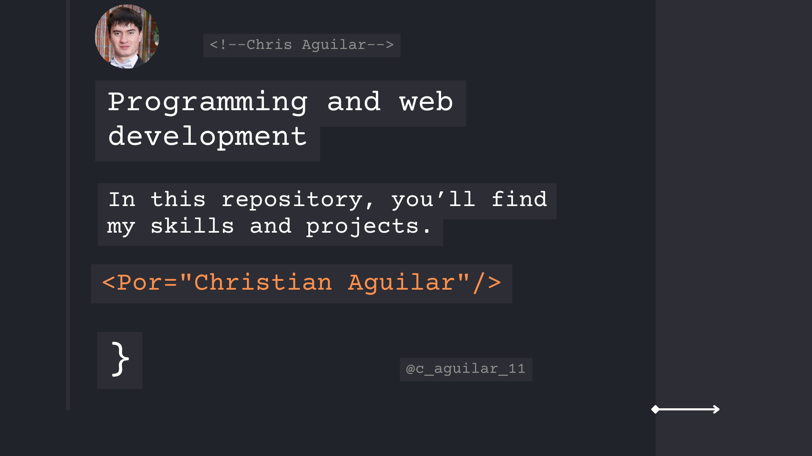

  <!-- GIF Bienvenida -->
  

  <!-- Título -->
  <h1 style="margin-top: 30px; font-weight: 900; font-size: 3.2rem; letter-spacing: 3px; color: #70a1ff;">
    👋 Welcome to my GitHub profile!
  </h1>

  <!-- Banner -->
  

  <!-- Bio -->
  

    I am a <strong style="color:#70a1ff;">passionate software developer</strong> with solid experience in <strong>Java</strong> and <strong>Spring Boot</strong> for backend development. I also have foundational knowledge in <strong>HTML</strong> and <strong>CSS3</strong>, eager to learn and grow constantly.  
    🚀 Always open to new challenges and collaborations to create impactful projects.
  

  <!-- Instagram Badge -->
  

  <!-- Skills -->
  <h2 style="
    font-weight: 900; 
    font-size: 2.8rem; 
    color: #9bb8a2ff; 
    letter-spacing: 2.5px; 
    margin-bottom: 40px;
    text-shadow: 0 0 8px #c84c4c99;
    text-align: center;
  ">
    🛠️ My Skills
 

  

  

  

  

 <h2 style="
  font-weight: 900; 
  font-size: 3rem; 
  color: #9bb8a2ff; 
  letter-spacing: 3px; 
  text-align: center; 
  margin-bottom: 40px; 
  text-shadow: 0 0 8px #c84c4c99;
">
  🎓 Educación y Experiencia
</h2>

  
  <article style="margin-bottom: 40px;">
    <h3 style="color: #70a1ff; font-weight: 700; font-size: 1.8rem; margin-bottom: 12px; border-left: 5px solid #70a1ff; padding-left: 15px;">
      🎓 Universidad de las Américas
    </h3>
    

      Currently pursuing a <strong>bachelor's degree in Computer Science</strong>, focusing on <em>software development</em>, <em>algorithms</em>, and <em>data structures</em>.  
      Involved in various academic projects and hackathons enhancing practical skills.
    

  </article>

  <article style="margin-bottom: 40px;">
    <h3 style="color: #70a1ff; font-weight: 700; font-size: 1.8rem; margin-bottom: 12px; border-left: 5px solid #70a1ff; padding-left: 15px;">
      🤝 Volunteer Experience
    </h3>
    

      Participated in tech volunteering events teaching programming basics to kids and supporting community digital literacy.  
      Passionate about <strong>sharing knowledge</strong> and fostering collective growth.
    

  </article>

  <article>
    <h3 style="color: #70a1ff; font-weight: 700; font-size: 1.8rem; margin-bottom: 20px; border-left: 5px solid #70a1ff; padding-left: 15px;">
      🌐 Languages & Soft Skills
    </h3>
    <ul style="list-style: none; padding-left: 20px; font-size: 1.15rem; color: #a0b9ff; line-height: 1.8;">
      <li style="margin-bottom: 12px;">🗣️ <strong>English:</strong> Intermediate (B1/B2) — improving communication and technical reading skills</li>
      <li style="margin-bottom: 12px;">🤝 <strong>Teamwork:</strong> Strong collaboration and interpersonal skills</li>
      <li style="margin-bottom: 12px;">🧠 <strong>Problem-solving:</strong> Analytical and solution-oriented mindset</li>
      <li style="margin-bottom: 12px;">🔄 <strong>Adaptability:</strong> Eager to learn new technologies and tools</li>
      <li>⏰ <strong>Time Management:</strong> Effective organization and prioritization skills</li>
    </ul>
  </article>

  

    ✨ Committed to continuous learning and creating impactful solutions.
  

</section>
